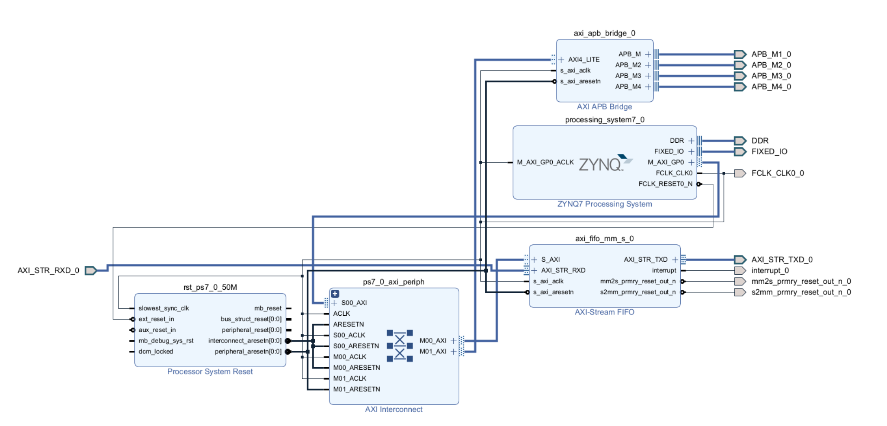

# LAN design

### Description
Make use of the *ETH PORT* connected via the PL fabric. The design makes use of an RGMII interface.
*DDR I/O* is used for dubble edge sampling. The reference frequency is multiplied by an embedded PLL.
Frequency is fixed to perform at 1 Gbps.

The design is running a base block design that includes the processing system.
the system is kept to a very minimal setup and shown below:

### Features
- PHY itf : 100/1000 Mbps (selectable)
- MAC itf : RGMII @ 4 x 125 MHz DDR
- MAC : Layer 2 frame processing TX and RX

### [I/O](constraints)
- PL ETH
- LED :
  - heartbeat : proportional to ETH clock
    - slow pulse : 100 Mbps
    - fast pulse : 1000 Mbps
- RESET button

### Development environment
- Windows 11
- Vivado 2023.1
- Vitis 2023.1
- Modelsim 10.5
- Notepadd++
- Wireshark

### Simulation
The [scripts/modelsim](scripts/modelsim/) folder contains the required do files to be loaded by modelsim.
  - Open modelsim from this location
  - Run the simulate.do file
Note : The first time the simulation is started, the vivado is required to build the simulation libraries containing the primitives
to do this , use gen_sim_libs.tcl in [scripts/vivado](scripts/vivado/) to create the xilinx libraries
The test bench will perform a few tests with either loopback (TX <> RX) or makes use of some reference frames

### FPGA release
The [scripts/vivado](scripts/vivado/) folder contains the required tcl files to be loaded by vivado.
  - Open vivado
  - Select run script from the menu
  - Select build.tcl
The script will create the project and output files and save into [release/vivado/](release/vivado/)
Note : The first time the build is started, the block design must be generated
to do this , use bd_base.tcl in [scripts/vivado/](scripts/vivado/) to create the base block design

### SW release
The application is currently a demonstration , to be ran on the first core of the PS system.
For now the GUI is used to write the code and load into the device. Relevant Vitis files are
stored in the [release/vitis/](release/vitis/)

### Testing
For testing a [wireshark](https://www.wireshark.org/) is installed on a normal windows laptop.
During installation keep the NPcap option. If not my USB-ETH adapter is not listed.

Plug in the USB-ETH adapter and give it an IP in the free range.

Open wireshark and start sniffing.
With a dummy packet , the wireshark is able to recieve about 200 Mbps in a setup
FPGA ETH TX >> ETH2USB >> LAN
where the Ethernet adapter is from a cheap brand and suspected to cause the drop in bandwidth

When the application is loaded, it will send 1 useless frame
the packet can be found in Wireshark

